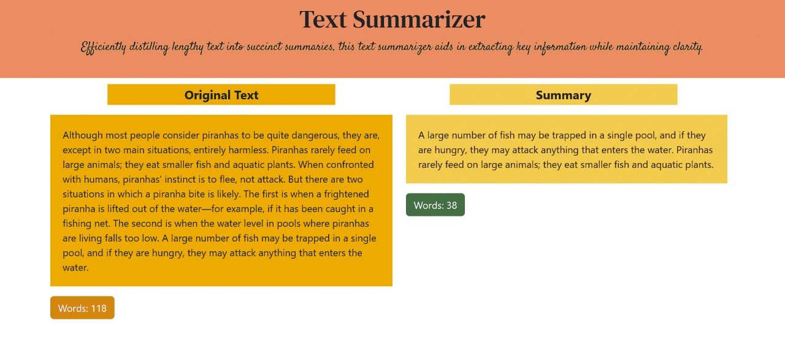

<h1>Text-Summarizer</h1>
This Python Flask web application utilizes cutting-edge Natural Language Processing (NLP) techniques to create succinct summaries of text passages. Through sophisticated algorithms and linguistic analysis, the application intelligently condenses input text, preserving key ideas and crucial information.
 
Additionally, the application provides a user-friendly interface that displays both the original passage and the generated summary, along with their respective word counts. This enables users to effortlessly compare the lengths and evaluate the extent of information compression achieved through the summarization process.
 
With the application now live, users can effortlessly access the text summarization feature from any location. Simply by navigating to the given link, they can input their desired text passage, initiate the summarization process, and promptly receive the condensed summary. This streamlined and effective solution streamlines the process of distilling crucial insights from lengthy texts, ultimately saving users valuable time and effort.
   
<h4> A Screenshot has been attached to show thw final output how it will be : Screenshot file is -----------------------> output.jpg <h4>   
<h2>Installation</h2>
To locally execute the Text Summarizer tool application, adhere to these steps:

<ol>
    <li>Clone or download this repository to your local machine.</li>
    <li>Navigate to the project directory: <code>cd Text-Summarizer</code></li>
    <li>Create and activate a virtual environment (optional but recommended):   <code>python3 -m venv venv   
 source venv/bin/activate</code></li>
    <li>You have to install the required dependencies----> <code>pip install -r requirements.txt</code></li>
    <li>Now you have to start the Flask development server: <code>python app.py</code></li>
    <li>Now please open your web browser and access the application at <a href="http://localhost:5000" target="_blank">http://localhost:5000</a>.</li>
</ol>
<h2>Features</h2>
<ul>
    <li>Generates text passage summaries automatically.</li>
    <li>Supplies word count for both the original passage and the generated summary.</li>
    <li>Boasts a user-friendly web interface crafted with HTML and CSS.</li>
    <li>Operated by Python Flask and NLP libraries.</li>
</ul>
<h2>Usage</h2>
<ol>
    <li>On the web interface, find a text input field.</li>
    <li>Type or paste your desired text passage into the assigned input field.</li>
    <li>Click the "Submit" button.</li>
    <li>The application will then analyze the input and generate a summary.</li>
    <li>You'll see both the original passage and the resulting summary, along with their respective word counts, displayed side by side.</li>
</ol>
<h2>Functionality Overview</h2>
The text summarizer application employs Natural Language Processing techniques to craft a brief summary of a provided text passage. For tasks such as tokenization, sentence segmentation, and feature extraction, it harnesses NLP libraries like NLTK and spaCy.    
The summary generation process in the application unfolds through the following steps:
<ol>
    <li>Retrieve the user's input text passage.</li>
    <li>Preprocess the text by eliminating unnecessary characters and applying formatting adjustments.</li>
    <li>Tokenize the text into words and sentences.</li>
    <li>Determine the word count of the initial passage.</li>
    <li>Utilize NLP techniques to extract significant features from the text.</li>
    <li>Compose a summary based on the extracted features.</li>
    <li>Compute the word count of the generated summary.</li>
    <li>Showcase the original passage, the summary, and their respective word counts on the web interface.</li>
</ol>
<h2>Contributions</h2>
Feel free to contribute! If you're interested in enhancing this project, kindly adhere to these steps:
<ul>
    <li>Fork the repository.</li>
    <li>Create a new branch.</li>
    <li>Implement your changes and commit them.</li>
    <li>Push your modifications to your forked repository.</li>
    <li>Submit a pull request outlining the alterations you've made.</li>
</ul>
